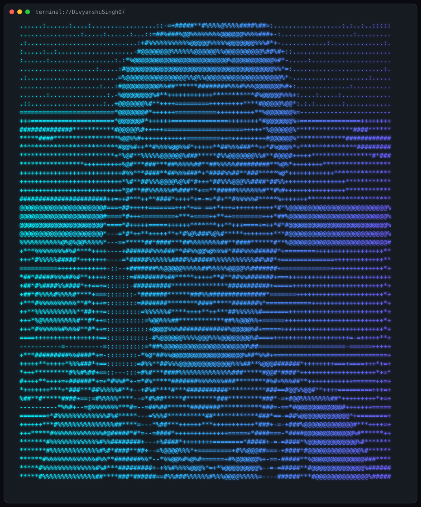

<table>
<tr>

<td width="52%" align="center" valign="top">

</td>

<td width="48%" valign="top">

## ❯ terminal://DivyanshuSingh07

### 🖥️ System

<table>
<tr>
<td><b>👤 Name</b></td>
<td>DIVYANSHU SINGH</td>
</tr>

<tr>
<td><b>💻 Role</b></td>
<td>React Developer</td>
</tr>

<tr>
<td><b>📍 Location</b></td>
<td>India</td>
</tr>

<tr>
<td><b>🚀 Status</b></td>
<td>Building cool things...</td>
</tr>
</table>

---

### 🧰 Toolbox

---

<table>

<tr>

<td width="52%" valign="top">

### 🌐 Connect

</td>

<td width="48%" valign="top">

### 📊 GitHub

| | |
|:--|--:|
| 📦 Repositories | 13 |
| ⭐ Stars | 0 |
| 👥 Followers | 1 |
| 🤝 Following | 0 |
| 🗓 Since | 2019 |

</td>

</tr>

</table>

</td>

</tr>
</table>